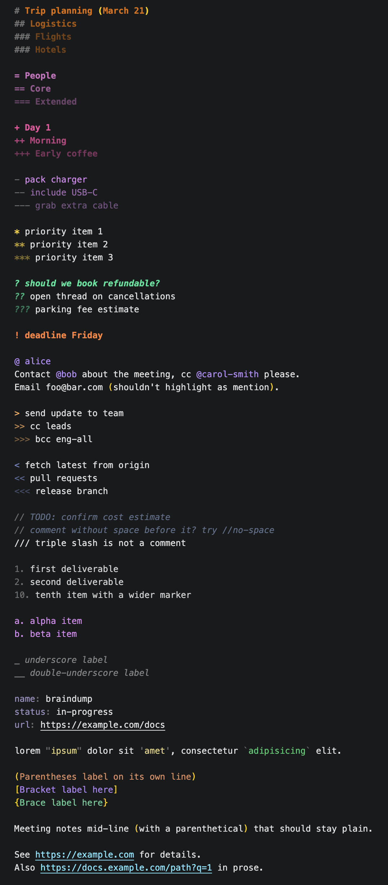
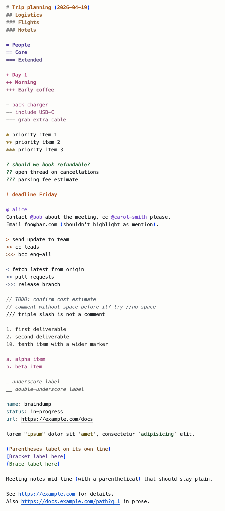

# Braindump Notes

A plain-text note-taking format for VS Code.

## What is Braindump?

Braindump is a set of simple symbols you put at the start of lines (`#` for a heading, `?` for a question, `!` for something important) that get color-coded as you type. It's a format for notes, not code.

You might be thinking: that sounds like Markdown. The difference is that **Braindump has no preview mode**. In Markdown, you write `## Heading` and then flip to a preview to see a styled heading without the `##`. In Braindump, the `##` stays visible on the screen, always. It gets colored, but it never disappears. What you type is what you read.

That one choice shapes everything about how Braindump works. It's meant for people who want to write notes fast, scroll through them later, and never think about "edit mode" vs "reading mode." Open a `.bd` file, type, close it. That's the whole loop.



## Getting started

1. Install the extension from the VS Code marketplace.
2. Create a file ending in `.bd`.
3. Start typing.

## The symbols

### At the start of a line

| Type this | What it means |
|---|---|
| `#`, `##`, `###` | Heading, three levels |
| `=`, `==`, `===` | Category |
| `+`, `++`, `+++` | Section |
| `-`, `--`, `---` | List item |
| `*`, `**`, `***` | Starred item |
| `?`, `??`, `???` | Question |
| `!` | Important / attention |
| `@ alice` | Person reference |
| `>` | Outbound action (send, push, …) |
| `<` | Inbound action (fetch, pull, …) |
| `//` | Comment |
| `a.`, `b.`, `c.` | Alphabetical list |
| `_`, `__` | Underline label (two quieter levels) |

For the three-level symbols (`#` / `##` / `###`, etc.), level 1 is the strongest color and levels 2 and 3 are quieter versions of the same color. A `## Subheading` reads as a muted sibling of `# Heading`, not a different thing.

### Anywhere in a line

| Type this | What it means |
|---|---|
| `@name` | Mention (works mid-line too) |
| `"text"` | Double-quoted string |
| `'text'` | Single-quoted string |
| `` `text` `` | Backticks (for code-like things) |
| `1.`, `2.`, `3.` | Numbered list |
| `key: value` | Label and value |
| `http://...` | Link (becomes clickable) |

Natural prose stays plain. Writing "(by the way)" mid-sentence doesn't get highlighted. Parens, brackets, and braces only get colored when they're on their own line as labels:

```
(Parentheses-only line)
[Bracket-only line]
{Brace-only line}
```

## What the extension does for you

### Outline

Press `Cmd+Shift+O` (Mac) or `Ctrl+Shift+O` (Windows/Linux) to open a searchable outline of the current note. Headings, categories, and sections show up as a nested tree; your open questions and important lines show up as a flat list underneath.

You can also open a permanent Outline panel from the Explorer sidebar. Scroll to the bottom and expand OUTLINE.

### Folding

Any heading-family line starter (`#` / `##` / `###`, `=` / `==` / `===`, `+` / `++` / `+++`) opens a fold. Click the triangle in the gutter next to the line, or use `Cmd+Option+[` / `Ctrl+Shift+[` to collapse; the section closes at the next line of the same or higher level.

### Cycling callouts

Press `Cmd+Enter` (Mac) or `Ctrl+Enter` (Windows/Linux) on a line to cycle it through callout types:

```
plain  →  ? question  →  ! important  →  * starred  →  plain
```

Select multiple lines first to cycle them all at once. Blank lines in the selection are left alone.

This shortcut replaces VS Code's built-in "insert line below" inside `.bd` files only. If you miss that behavior, you can rebind from Settings → Keyboard Shortcuts.

### Mention completion

Type `@` in any note and you'll get a dropdown with every `@name` you've used across all your `.bd` files, with the most-used names at the top. It picks up new names as you type, even before saving.

Email addresses like `foo@bar.com` don't trigger the dropdown and don't pollute the suggestions.

### Status bar counter

A small counter at the bottom-right of VS Code shows how many open questions are in the current note. Click it to get a list of every question and jump to any of them.

You can switch it to count important (`!`) or starred (`*`) items instead, or have it show a total across your whole workspace. See Settings below.

### Snippets

Shortcuts that expand when you type them and press Tab:

| Type this | You get |
|---|---|
| `today` | Today's date, e.g. `2026-04-20` |
| `h1`, `h2`, `h3` | `# `, `## `, `### ` with cursor after |
| `q` | `? ` |
| `imp` | `! ` |
| `kv` | `key: value` with tab stops on the key and value |

## Themes

Braindump works in any VS Code theme you already use. Whatever you read code in will color `.bd` files too.

Two extra themes ship alongside, tuned specifically for `.bd` files. Press `Cmd+K Cmd+T` (Mac) or `Ctrl+K Ctrl+T` (Windows/Linux) and pick `Braindump Dark` or `Braindump Light` to try them.



## Keyboard shortcuts

| Keys | What it does |
|---|---|
| `Cmd+Enter` / `Ctrl+Enter` | Cycle callout on the current line |
| `Cmd+Shift+O` / `Ctrl+Shift+O` | Jump to a heading or question in this file |

## Settings

All under `braindump.*` in VS Code settings:

| Setting | Options | Default | What it controls |
|---|---|---|---|
| `braindump.statusBar.track` | `questions`, `important`, `starred`, `off` | `questions` | Which line type the status bar counts |
| `braindump.statusBar.scope` | `file`, `workspace`, `off` | `file` | Count just the current file, count across your whole workspace, or hide the counter |

## Troubleshooting

**Colors look wrong in my theme.** Open the command palette and run `Developer: Inspect Editor Tokens and Scopes`. Click any token — the panel tells you which scope the grammar emitted and which theme rule matched. If a scope is missing or the theme rule looks surprising, file an issue with that output and the theme name.

**My note isn't colored.** Look at the bottom-right of the status bar. If it says "Plain Text" instead of "Braindump," click it and pick "Braindump" from the list. Saving the file with a `.bd` extension should make this automatic.

**The outline is empty.** Same fix. Make sure the file is recognized as Braindump. Once it is, headings appear in the outline right away.

**`Cmd+Enter` isn't cycling callouts.** Another extension might have taken the shortcut. Open Settings → Keyboard Shortcuts, search for `cmd+enter`, and find the conflict.

**Mention suggestions are empty.** Suggestions only come from `.bd` files. Make sure your notes are saved with that extension and aren't excluded by a `.gitignore`.

## Issues and feedback

Report issues at [github.com/massihx/braindump-extension](https://github.com/sweetlemonai/braindump-vscode).

Release notes: [CHANGELOG.md](CHANGELOG.md).

## License

MIT.