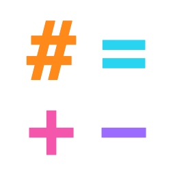
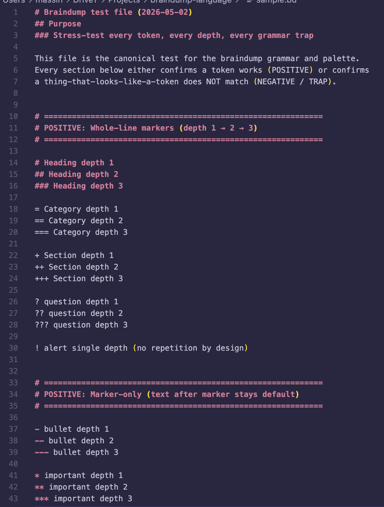

<div align="center">
  
  <h1>Braindump</h1>
  <p>Syntax highlighting for <code>.bd</code> note-taking files in VS Code.</p>
</div>

---

Braindump is a lightweight note syntax built around line-leading markers (`#`, `+`, `-`, `*`, `?`, `!`, `>`, `<`, `//`) and a few inline tokens (`@mention`, `--flag`, URLs, `"strings"`). This extension paints all of them — and only inside `.bd` files. Your other files stay untouched, regardless of what theme you use.

## Syntax preview



## Syntax at a glance

| Construct | What it does | Whole-line / Marker only |
|---|---|---|
| `# heading` `## …` `### …` | Heading, three depths | Whole line |
| `= category` `==` `===` | Category, three depths | Whole line |
| `+ section` `++` `+++` | Section, three depths | Whole line |
| `? question` `??` `???` | Question (italic), three depths | Whole line |
| `! alert` | Alert (bold) | Whole line |
| `// comment` | Line comment (italic) | Whole line |
| `1.` `a.` `A.` | Numbered / lettered list | Whole line |
| `> forward` `>>` `>>>` | Forward reference, three depths | Whole line |
| `< back` `<<` `<<<` | Back reference, three depths | Whole line |
| `- bullet` `--` `---` | Bullet, three depths | Marker only |
| `* important` `**` `***` | Priority (bold body, red marker), three depths | Marker red + line bold |
| `key: value` | Key/value pair | Key colored; value colored in light, default in dark |
| `(line)` `[line]` `{line}` | Bracket / brace lines | Whole line, distinct char + content colors |
| `@mention` / `@ mention` | Mention (token) | Token only |
| `--flag` | CLI flag (token) | Token only |
| `https://…` | URL (token, underlined) | Token only |
| `"double"` | String (token) | Token only |
| ` ``` ` … ` ``` ` | Fenced code block (suspends all tokens inside) | Block |

Full positive / negative / edge-case coverage lives in `sample.bd`.

## How the colors work

Colors are contributed via `configurationDefaults.editor.tokenColorCustomizations` in `package.json`. Every grammar scope ends in `.braindump` so the rules only fire inside `.bd` files — nothing else in your editor is affected.

The dark palette is the default. The light palette is contributed via the `[*Light*]` theme-name glob, which matches "Default Light+", "GitHub Light", "Solarized Light", "Quiet Light", etc. Themes that are visually light but don't include `Light` in their name will receive the dark palette — workaround is a personal `settings.json` override.

### Light vs dark asymmetry (intentional)

The dark palette colors only the **key** in `key: value` (value falls through to default text). The light palette colors **both** key (`#155E75`) and value (`#0891B2`). This is by design.

## Install

### From the Marketplace

```bash
code --install-extension sweet-lemon.braindump-language
```

### From a local `.vsix`

```bash
npx -y @vscode/vsce package
code --install-extension braindump-language-1.2.0.vsix
```

To uninstall:

```bash
code --uninstall-extension sweet-lemon.braindump-language
```

## Develop locally

Open the project in VS Code, then launch a clean dev-host window with the extension loaded:

```bash
code --extensionDevelopmentPath="$PWD" sample.bd
```

The dev host runs in isolation; closing the window unloads the extension. Use **Developer: Reload Window** (`Cmd+R`) after editing the grammar JSON or `package.json` to pick up changes.

To inspect grammar scope assignment, run **Developer: Inspect Editor Tokens and Scopes** in the dev host and click any character in `sample.bd` — the panel shows the full scope stack.

## Build

```bash
npx -y @vscode/vsce package
```

Produces `braindump-language-1.2.0.vsix` in the project root. No `npm install`, no compile step — the extension contributes only declarative JSON.

## Contributing

Issues and PRs welcome. The grammar lives in [`syntaxes/braindump.tmLanguage.json`](syntaxes/braindump.tmLanguage.json); colors live in `package.json` under `contributes.configurationDefaults`.

## License

MIT.
